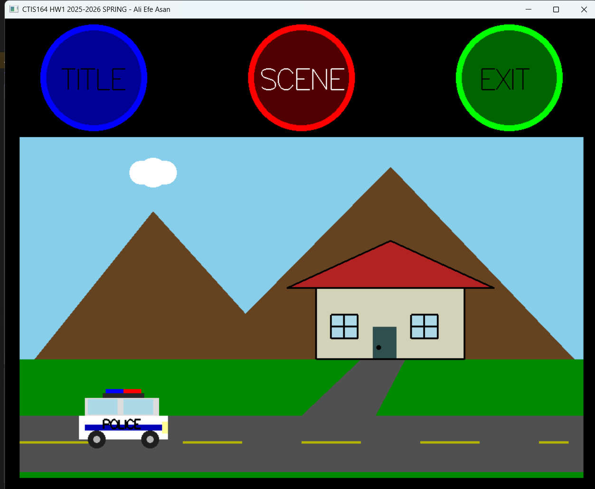
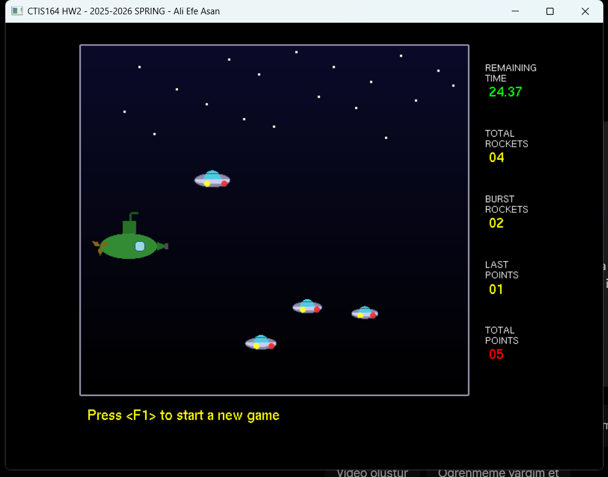

# Bilkent University - CTIS 164 Projects

This repository contains graphical projects developed for the **CTIS 164: Technical Mathematics with Programming** course (2025-2026 Spring). Both applications are written in **C** using **OpenGL/GLUT**.

---

## 🏗️ Project 1: Interactive 2D Scene
A 2D graphical application featuring a dual-mode interface and procedural animations.

### Features
* **Interactive Menu:** Circular buttons with hover effects using passive motion detection.
* **Animations:** A custom-designed Police Car and moving cloud system.
* **Environment:** Multi-layered scene with mountains, a house, and a highway.
* **Interaction:** Euclidean distance-based collision detection for mouse clicks.

---

## 🎮 Project 2: Deep Sea Defender (Hit the Target)
A "hit the target" style game focused on game logic, timers, and collision physics.

### Features
* **Player Control:** A submarine that moves vertically to aim and shoot.
* **Gameplay:** Launch projectiles with the Space Bar to hit moving UFO targets.
* **Game Logic:**
    * 30-second countdown timer.
    * Real-time scoring based on hit precision.
    * **F1** to start/restart, **ESC** to pause/resume.
* **UI:** Dedicated gaming area, scoreboard, and function key guide.

---

## 📸 Screenshots

| Homework 1 | Homework 2 |
| :---: | :---: |
|  |  |

---

## 📜 Disclaimer
This repository is for portfolio purposes only. 
* **Current Students:** Copying this code or using AI for your assignments is against Bilkent University's academic integrity policy.

---

**Author:** Ali Efe Asan  
**University:** Bilkent University  
**Department:** CTIS
